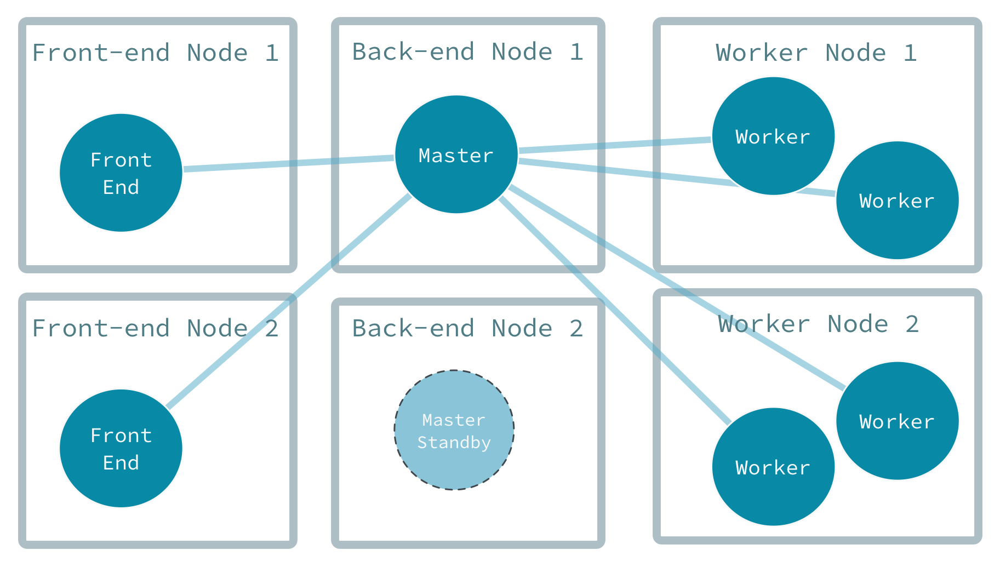

# Akka Distributed Workers with Scala Guide

To be reactive, distributed applications must deal gracefully with temporary and prolonged outages as well as have 
the ability to scale up and down to make the best use of resources. 
Akka Cluster provides these capabilities so that you don't have to implement them yourself. 
The distributed workers example demonstrates the following Akka clustering capabilities:

 * elastic addition and removal of the front-end actors that accept client requests
 * elastic addition and removal of the back-end actors that perform the work distribution of actors across different nodes
 * how jobs are re-tried in the face of failures

The design is based on Derek Wyatt's blog post [Balancing Workload Across Nodes with Akka 2](http://letitcrash.com/post/29044669086/balancing-workload-across-nodes-with-akka-2) from 2009, which is a bit old, but still a good description of the advantages of letting the workers pull work from the master instead of pushing work to the workers.

## Running the example

To run the example: 

```
sbt run
```

After waiting a few seconds for the cluster to form the output should start look _something_ like this (scroll all the way to the right to see the Actor output):
 
```
[INFO] [07/21/2017 17:41:53.320] [ClusterSystem-akka.actor.default-dispatcher-16] [akka://ClusterSystem@127.0.0.1:51983/user/producer] Produced work: 3
[INFO] [07/21/2017 17:41:53.322] [ClusterSystem-akka.actor.default-dispatcher-3] [akka://ClusterSystem@127.0.0.1:2551/user/master/singleton] Accepted work: 3bce4d6d-eaae-4da6-b316-0c6f566f2399
[INFO] [07/21/2017 17:41:53.328] [ClusterSystem-akka.actor.default-dispatcher-3] [akka://ClusterSystem@127.0.0.1:2551/user/master/singleton] Giving worker 2b646020-6273-437c-aa0d-4aad6f12fb47 some work 3bce4d6d-eaae-4da6-b316-0c6f566f2399
[INFO] [07/21/2017 17:41:53.328] [ClusterSystem-akka.actor.default-dispatcher-2] [akka://ClusterSystem@127.0.0.1:51980/user/worker] Got work: 3
[INFO] [07/21/2017 17:41:53.328] [ClusterSystem-akka.actor.default-dispatcher-16] [akka://ClusterSystem@127.0.0.1:51980/user/worker] Work is complete. Result 3 * 3 = 9.
[INFO] [07/21/2017 17:41:53.329] [ClusterSystem-akka.actor.default-dispatcher-19] [akka://ClusterSystem@127.0.0.1:2551/user/master/singleton] Work 3bce4d6d-eaae-4da6-b316-0c6f566f2399 is done by worker 2b646020-6273-437c-aa0d-4aad6f12fb47
```
   
Now take a look at what happened under the covers. 

## What happens when you run it

When `Main` is run without any parameters, it starts six `ActorSystem`s in the same JVM. These six `ActorSystem`s form a single cluster. The six nodes include two each that perform front-end, back-end, and worker tasks:

 * The front-end nodes simulate an external interface, such as a REST API, that accepts workloads from clients.
 * The worker nodes have worker actors that accept and process workloads.
 * The back-end nodes contain a Master actor that coordinates workloads, keeps track of the workers, and delegates work to available workers. One of the nodes is active and one is on standby. If the active Master goes down, the standby takes over.

A bird's eye perspective of the architecture looks like this:



Let's look at the details of each part of the application, starting with the front-end.

* [The Front-end Nodes](front-end.md)
* [The Back-end Nodes](back-end.md)
* [The Master Actor in Detail](master-in-detail.md)
* [The Worker Nodes](worker.md)
* [Experimenting with the example](experimenting.md)
* [Next Steps](next-steps.md)
