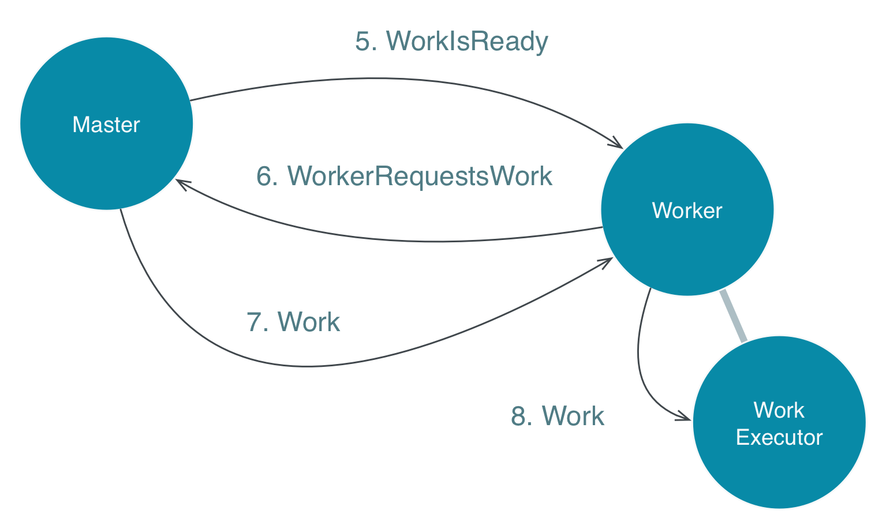

# The Worker Nodes

`Worker` actors and the `Master` actor interact as follows:

1. `Worker` actors register with the `Master` so the master knows they are available and ready to take on work.
1. When the `Master` actor has work, it sends a `WorkIsReady` message to all workers it thinks are not busy.

1. The `Master` picks the first reply and assigns the work to that worker. 
   This achieves back pressure because the `Master` does not push work on workers that are already busy and overwhelm 
   their mailboxes.
1. When the worker receives work from the master, it delegates the actual processing to a child actor, `WorkExecutor`. 
   This allows the worker to be responsive while its child executes the work.

You can see how a worker node and a number of worker actors is started in the method `Main.startWorker`
if the node contains the role `worker`:

@@snip [Main.scala]($g8src$/scala/worker/Main.scala) { #worker }

Now that we have covered all the details, we can experiment with different sets of nodes for the cluster.
